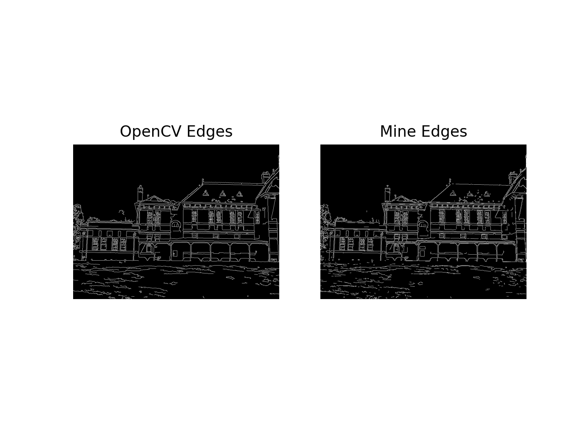
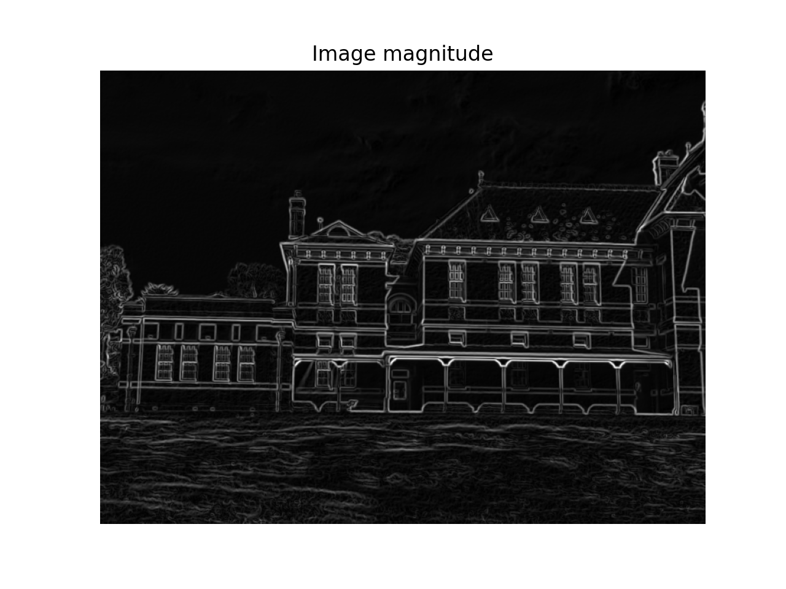
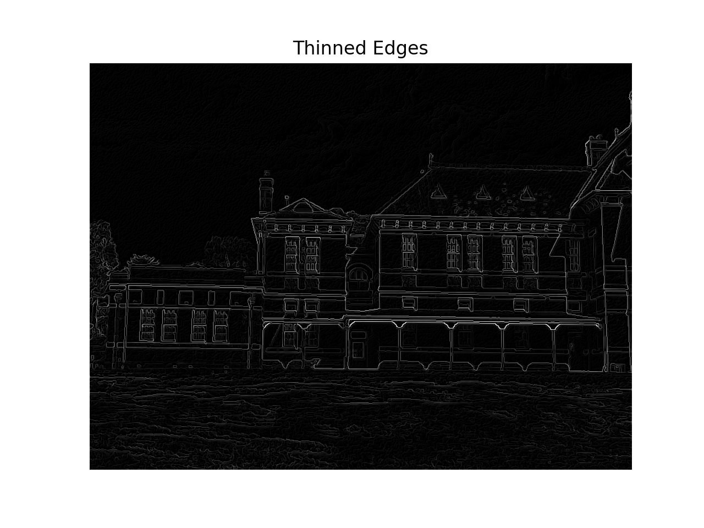
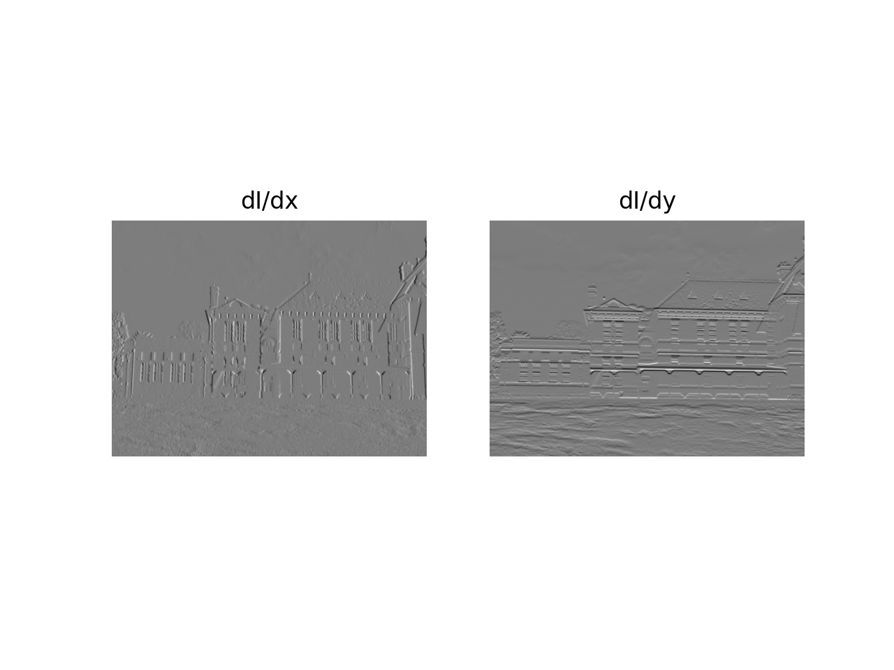
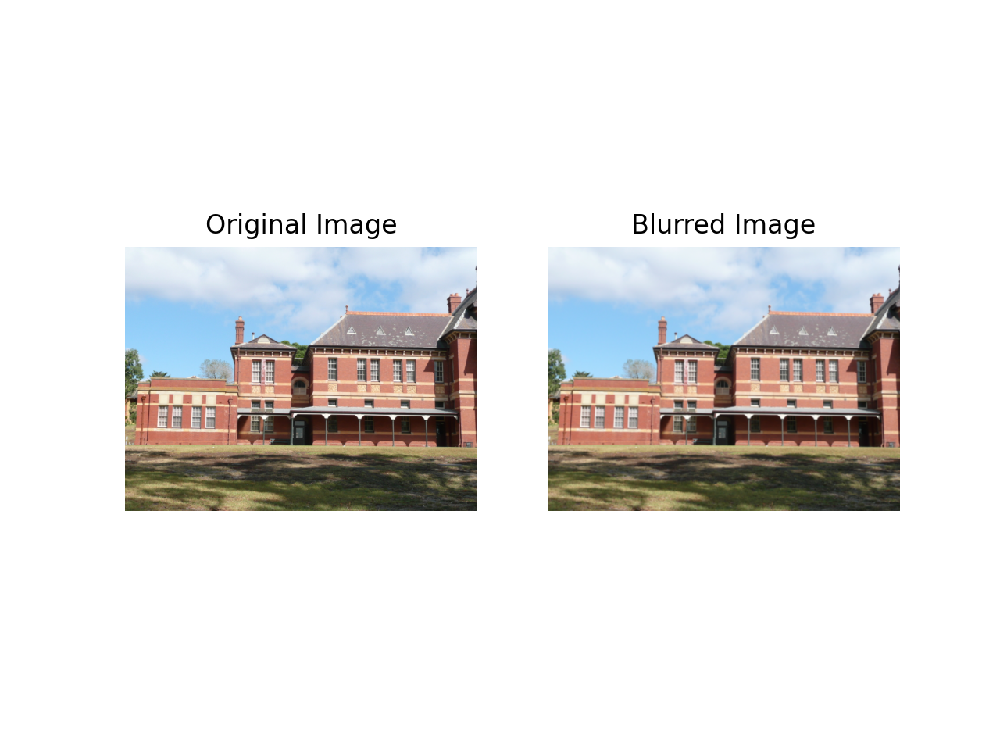

## About

This is an implementation of Canny Edge Detector Algorithm with Python

## Prerequisites 

Install OpenCV:
```
pip install opencv-python
```

Install Matplotlib:
```
pip install matplotlib
```

Install NumPy:
```
pip install numpy
```

## Run:
```
python Canny.py
```

## Author

Theodoros Kyriakou

## Results

Original Image             |  Edge Detection Results
:-------------------------:|:-------------------------:
  |  
Magnitude | Edge Thinning
 | 
1st order partial derivatives | Gaussian Blurring
 | 
